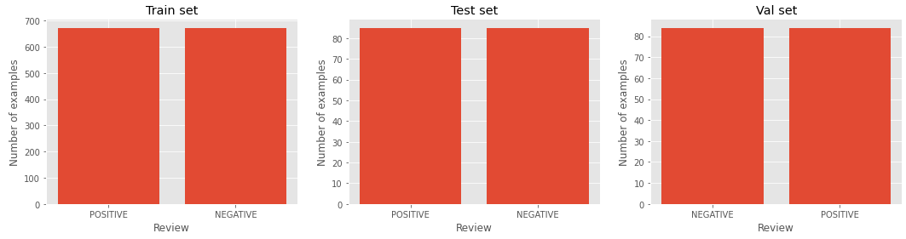

# Long-texts-Sentiment-Analysis-RoBERTa
Sentiment Analysis of the long texts written in Serbian language (which is underused language) using pretrained Multilingual RoBERTa based model (XLM-R) on the small dataset.
# Dataset
Dataset is balanced and it consits of only **1684** **positive** and **negative** reviews, and it can be found [here](https://github.com/vukbatanovic/SerbMR). This balanced dataset is a subset of unbalanced set of 4725 movie reviews. Reviews have scoring metric which ranges from 1 to 10. Scores from 1-4 are treated as negative, 5-6 as neutral and 7-10 as positive. So some reviews have very weak sentiment and are very hard to classify correctly even by humans.  

Click to see an example

  
`Braća Koen (Coen brothers) iako poznati po trilerima, oprobali su se više puta i u komedija, i postigli potpuni uspeh.
Ovaj film, pošto je kada se pojavio bio vrlo loše prihvaćen, nije nažalost uspeo da zablista po američkim bioskopima, ali je zato bio prava senzacija kad se pojavio na DVD-u i na osnovu toga, postao jedan od glavnih naslova u kolekciji svakog pravog filmofila.
„The Big Lebowski“ definitvno moj omiljeni film i jedino ostvarenje koje zaista uvek iznova i iznova mogu da gledam.
On predstavlja odu životnom stilu jednog pacifiste.
„The Big Lewbowski“ je klasična priča prevare, kriminala i spletkarenja viđena kroz oči skromnog čoveka, tačnije jednostavne individue sa vrlo malo prohteva, želja i ambicija.
Žanr ovog filma nije lako odrediti – može se reći da je komedija zbog svog izuzetno originalnog humorističkog sadržaja.
Bogat fantastičnim likovima i još boljim dijalozima, koji iako su se transformisali u besmrtne citate koji se koriste u svakodnevnom životu, „The Big Lebowski“ i pored ovih sada već navedenih segmenata ima još toliko mnogo toga da ponudi.
Gluma u ovom filmu je zaista neponovljiva.
Definitvni vrh karijere za Džefa Bridžesa (Jeff Bridges) i Džona Gudmana (John Goodman).
Iako su obojica vrhunska klasa glumaca, sa izvanrednim karijerama, nikada nisu uspeli da se udalje od ovih kultnih likova, a otuda i Bridžesu nadimak koji ga prati već deceniju i pratiće ga ceo život – The Dude.
Cela glumačka ekipa je izuzetnog kvaliteta.
Tu stoje još imena kao što su Stiv Bušemi (Steve Buscemi), Džon Torturo (John Turturro), Džulijana Mur (Julianne Moore) i Filip Sejmur Hofman (Philip Seymour Hoffman).
Svako je zaista uradio i više što se od njih moglo očekivati, a pogotovo Torturo koje je ovde stvario jednog od najzabavnijih epizodnih likova u svim filmovima ikada.
Po mom mišljenju, „The Big Lebowski“ je jedno od najvećih dostignuća u modernoj kinematografiji.
Ovaj projekat će vas nasmejati, zbuniti i zadiviti, i on se sa razlogom smatra za jednu od najcenjenijih komedija od strane većine kritičara.`

 
Dataset is splitted into train, val and test sets with percentages respectively: 80%, 10%, 10%, in the way that new sets are balanced.

# Model
